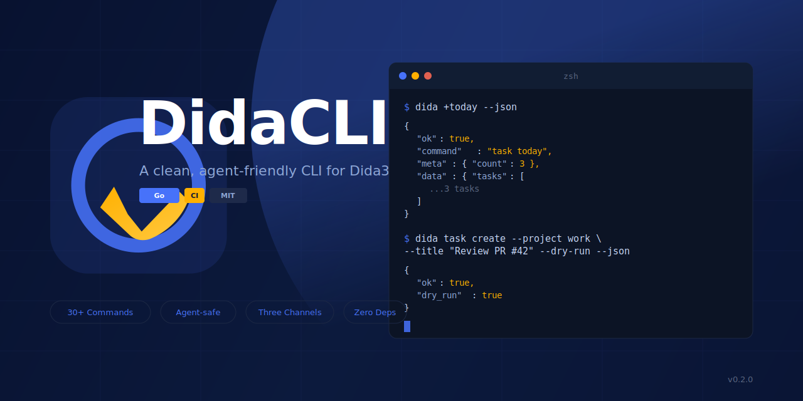

<p align="center">
  
</p>

<p align="center">
  <a href="https://github.com/DeliciousBuding/dida-cli/actions/workflows/ci.yml"></a>
  <a href="https://github.com/DeliciousBuding/dida-cli/releases/latest"></a>
  <a href="https://github.com/DeliciousBuding/dida-cli/blob/main/LICENSE"></a>
  
  <a href="https://github.com/DeliciousBuding/dida-cli/releases"></a>
</p>

<p align="center">
  <b>A clean, agent-friendly command line client for <a href="https://dida365.com">Dida365</a> / <a href="https://ticktick.com">TickTick</a></b>
</p>

<p align="center">
  <a href="README.zh-CN.md">中文</a> &nbsp;&middot;&nbsp;
  <a href="https://deliciousbuding.github.io/dida-cli/">Website</a> &nbsp;&middot;&nbsp;
  <a href="docs/quickstart.md">Quickstart</a> &nbsp;&middot;&nbsp;
  <a href="docs/commands.md">Commands</a> &nbsp;&middot;&nbsp;
  <a href="docs/README.md">Docs</a>
</p>

---

## Why DidaCLI?

Dida365 has a great UI, but no stable CLI for automation. DidaCLI fills that gap with a single Go binary that talks to Dida365's private Web API, official MCP, and official OpenAPI -- designed for humans **and** AI agents that need predictable, structured task operations.

```
$ dida +today --json
{
  "ok": true,
  "command": "task today",
  "meta": { "count": 3 },
  "data": {
    "tasks": [
      { "title": "Review lab notes", "priority": 3, "status": 0 },
      { "title": "Push to main",     "priority": 1, "status": 0 },
      { "title": "Write tests",      "priority": 0, "status": 0 }
    ]
  }
}
```

## Highlights

| | Feature | Description |
|---|---|---|
| **30+ commands** | Full CRUD | Tasks, projects, folders, tags, columns, comments, filters, habits, Pomodoro, trash, search, stats |
| **Agent-safe JSON** | Consistent envelope | Every `--json` response uses `{ ok, command, meta, data, error }` |
| **Three auth channels** | Web API + MCP + OpenAPI | Browser cookie, official token, OAuth -- never mixed |
| **Dry-run writes** | Preview before commit | All write commands support `--dry-run` to preview payloads |
| **Zero dependencies** | Single binary | Pure Go stdlib, no CGO, no runtime deps |
| **Six platforms** | Cross-compiled | Windows / Linux / macOS on amd64 and arm64 |

## Install

**macOS / Linux:**

```bash
curl -fsSL https://raw.githubusercontent.com/DeliciousBuding/dida-cli/main/install.sh | sh
```

**Windows PowerShell:**

```powershell
iwr https://raw.githubusercontent.com/DeliciousBuding/dida-cli/main/install.ps1 -UseB | iex
```

**Go:**

```bash
go install github.com/DeliciousBuding/dida-cli/cmd/dida@latest
```

**npm:**

```bash
npm install -g @vectorcontrol/dida-cli
```

<details>
<summary><b>Pin a specific version</b></summary>

```bash
# macOS / Linux
DIDA_VERSION=v0.2.0 curl -fsSL https://raw.githubusercontent.com/DeliciousBuding/dida-cli/main/install.sh | sh

# Windows
$env:DIDA_VERSION="v0.2.0"; iwr https://raw.githubusercontent.com/DeliciousBuding/dida-cli/main/install.ps1 -UseB | iex
```

</details>

## Quick Start

```bash
# 1. Login (opens browser, captures only the t cookie)
dida auth login --browser --json

# 2. Verify everything works
dida doctor --verify --json

# 3. See today's tasks
dida +today --json

# 4. Create a task (dry-run first)
dida task create --project <id> --title "Ship v1" --dry-run --json
dida task create --project <id> --title "Ship v1" --json

# 5. Get a context pack for agents
dida agent context --outline --json
```

## Commands at a Glance

<details>
<summary><b>Reading data</b></summary>

```bash
dida +today --json                       # Today's tasks
dida task upcoming --days 14 --json      # Next two weeks
dida task search --query "exam" --json   # Search tasks
dida project list --json                 # All projects
dida folder list --json                  # All folders
dida tag list --json                     # All tags
dida completed today --json              # Completed today
dida pomo stats --json                   # Pomodoro stats
dida habit checkins --habit <id> --json  # Habit check-ins
dida stats general --json                # Account stats
```

</details>

<details>
<summary><b>Writing data</b></summary>

```bash
dida task create --project <id> --title "New task" --json
dida task update <task-id> --project <id> --title "Updated" --json
dida task complete <task-id> --project <id> --json
dida task move <task-id> --project <id> --to-project <dest-id> --json
dida task delete <task-id> --project <id> --yes --json
dida project create --name "New project" --json
dida tag create my-tag --json
```

</details>

<details>
<summary><b>Official channels</b></summary>

```bash
# Official MCP (token-based)
DIDA365_TOKEN=dp_xxx dida official doctor --json
dida official project list --json
dida official task query --query "today" --json

# Official OpenAPI (OAuth-based)
dida openapi client set --id <client-id> --secret-stdin --json
dida openapi login --browser --json
dida openapi project list --json
```

</details>

Full command reference: [docs/commands.md](docs/commands.md)

## Architecture

```
                    dida-cli
            ┌──────────┼──────────┐
            │          │          │
        Web API    Official MCP  OpenAPI
        (cookie)    (token)     (OAuth)
            │          │          │
            └──────────┼──────────┘
                       │
              ┌────────┴────────┐
              │   CLI Layer     │  30+ commands, JSON envelopes
              │   internal/cli/ │  schema registry, dry-run
              ├─────────────────┤
              │   Model Layer   │  Normalized Task/Project/Column
              │ internal/model/ │  Search, filtering, upcoming
              ├─────────────────┤
              │   API Clients   │  HTTP + MCP protocol
              │ internal/webapi │
              │ internal/officialmcp
              │ internal/openapi│
              └─────────────────┘
```

## Agent Integration

DidaCLI is designed from the ground up for AI agent workflows. Agents can:

1. **Discover commands** via `dida schema list --compact --json`
2. **Build context** via `dida agent context --outline --json`
3. **Preview writes** via `--dry-run` before executing
4. **Parse responses** from the stable JSON envelope

A repo-local agent skill is included at [`skills/dida-cli/SKILL.md`](skills/dida-cli/SKILL.md).

Install for your agent:

| Agent | Instructions |
|---|---|
| Claude Code | Copy `skills/dida-cli/SKILL.md` to your skills directory |
| Codex | See [docs/skill-installation.md](docs/skill-installation.md) |
| Hermes | See [docs/skill-installation.md](docs/skill-installation.md) |

```bash
# Agent workflow: context -> schema -> dry-run -> execute
dida agent context --outline --json
dida schema list --compact --json
dida task create --project <id> --title "Agent task" --dry-run --json
dida task create --project <id> --title "Agent task" --json
```

## Why Not Just Use the Official API?

| | DidaCLI Web API | Official OpenAPI | Official MCP |
|---|---|---|---|
| **Auth** | Browser cookie | OAuth app | Token |
| **Coverage** | Broadest (private endpoints) | Projects, tasks, focus, habits | Tool-based (MCP protocol) |
| **Write safety** | Dry-run + confirm | Dry-run | Dry-run (local preview) |
| **Agent mode** | JSON envelopes, schema | JSON responses | MCP tool schemas |
| **Setup effort** | One browser login | Register OAuth app | Get token |

Use Web API for maximum coverage, OpenAPI for standard REST integration, and MCP for official tool access. They're separate auth channels -- never mixed.

## Documentation

- [Quickstart](docs/quickstart.md) -- Get running in 2 minutes
- [Commands Reference](docs/commands.md) -- Every command, every flag
- [Agent Usage](docs/agent-usage.md) -- How to use DidaCLI with AI agents
- [API Coverage](docs/api-coverage.md) -- What endpoints are covered
- [OpenAPI Setup](docs/openapi-setup.md) -- OAuth channel configuration
- [Distribution](docs/distribution.md) -- Build from source, packaging

## Contributing

Contributions are welcome. See [CONTRIBUTING.md](CONTRIBUTING.md) for guidelines.

```bash
git clone https://github.com/DeliciousBuding/dida-cli.git
cd dida-cli
go test ./...
go build -o bin/dida ./cmd/dida
```

## License

[MIT](LICENSE)
