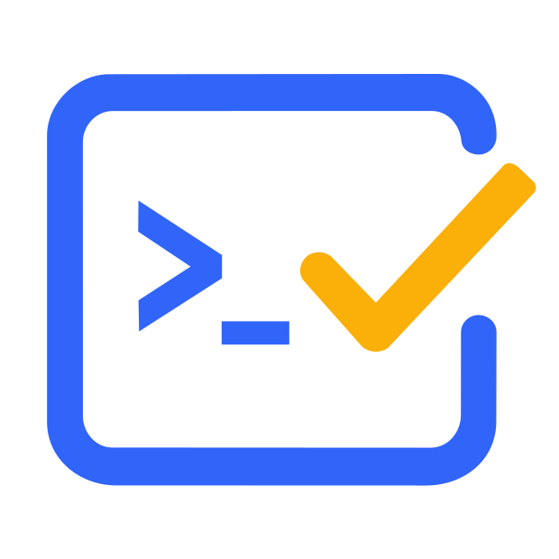

<p align="center">
  
</p>

<h1 align="center">DidaCLI</h1>

<p align="center">
  <b>面向 <a href="https://dida365.com">Dida365</a> / <a href="https://ticktick.com">TickTick</a> 的 Agent 友好型任务自动化工具</b>
</p>

<p align="center">
  <a href="https://github.com/DeliciousBuding/dida-cli/blob/main/LICENSE"></a>
  
  <a href="https://github.com/DeliciousBuding/dida-cli/releases/latest"></a>
  <a href="https://github.com/DeliciousBuding/dida-cli/actions/workflows/ci.yml"></a>
  <a href="https://www.npmjs.com/package/@vectorcontrol/dida-cli"></a>
</p>

<p align="center">
  <a href="README.md">English</a> ·
  <a href="https://deliciousbuding.github.io/dida-cli/">项目主页</a> ·
  <a href="docs/quickstart.zh-CN.md">快速开始</a> ·
  <a href="docs/commands.md">命令参考</a> ·
  <a href="CONTRIBUTING.md">参与贡献</a>
</p>

---

DidaCLI 是一个 Go 单二进制文件，同时接入 Dida365/TickTick 的 **Web API**、**官方 MCP** 和 **官方 OpenAPI**——为人类和 AI Agent 设计，提供结构化、可预测的任务自动化。

```bash
$ dida task today --json
{
  "ok": true,
  "command": "task today",
  "meta": { "count": 3 },
  "data": {
    "tasks": [
      { "title": "写周报", "project": "工作" },
      { "title": "Review PR #42", "project": "工作" },
      { "title": "买菜", "project": "生活" }
    ]
  }
}
```

## 为什么选 DidaCLI？

- **Agent 原生 JSON** — 每个响应使用稳定的信封结构 `{ ok, command, meta, data, error }`。无需 HTML 解析，无需脆弱的爬虫。
- **三通道认证** — Web API（浏览器 Cookie）、官方 MCP（Token）、官方 OpenAPI（OAuth）。互不混用。
- **Dry-run 写入** — 所有写命令支持 `--dry-run`，执行前预览请求体。
- **零依赖** — 单个静态二进制文件，纯 Go stdlib，无 CGO。
- **六平台** — Windows / Linux / macOS，amd64 + arm64。Apple Silicon 原生支持。
- **30+ 命令** — 任务、项目、文件夹、标签、列、评论、习惯、番茄钟、回收站、搜索、统计等。

## 功能特性

| 分类 | 能力 |
|---|---|
| **任务** | 创建、更新、完成、删除、移动、批量操作、评论、附件 |
| **项目与文件夹** | 列表、创建、层级管理、列、排序 |
| **标签与过滤** | 创建、分配、按标签过滤、保存过滤器 |
| **搜索与查询** | 全文搜索、即将到来的任务、已完成历史 |
| **习惯与番茄钟** | 打卡追踪、番茄钟统计与计时 |
| **Agent 上下文** | 大纲模式、Schema 自省、上下文包 |
| **认证与安全** | 多通道认证、`doctor` 诊断、Token 管理 |
| **Dry-run 与 Schema** | 预览所有写操作、查看 API Schema |

## 支持平台

| 平台 | 架构 | 压缩格式 | 安装方式 |
|---|---|---|---|
| **macOS** | Apple Silicon (arm64) | `.tar.gz` | `curl ... \| sh` / Homebrew |
| **macOS** | Intel (amd64) | `.tar.gz` | `curl ... \| sh` / Homebrew |
| **Linux** | x86_64 (amd64) | `.tar.gz` | `curl ... \| sh` |
| **Linux** | ARM64 (arm64) | `.tar.gz` | `curl ... \| sh` |
| **Windows** | x86_64 (amd64) | `.zip` | Scoop / PowerShell |
| **Windows** | ARM64 (arm64) | `.zip` | Scoop / PowerShell |

## 安装

### npm（推荐）

```bash
npm install -g @vectorcontrol/dida-cli
```

### macOS / Linux

```bash
curl -fsSL https://raw.githubusercontent.com/DeliciousBuding/dida-cli/main/install.sh | sh
```

### Homebrew（macOS / Linux）

```bash
brew install dida
```

### Windows（Scoop）

```powershell
scoop install dida
```

### Windows（PowerShell）

```powershell
iwr https://raw.githubusercontent.com/DeliciousBuding/dida-cli/main/install.ps1 -UseB | iex
```

### Go

```bash
go install github.com/DeliciousBuding/dida-cli/cmd/dida@latest
```

<details>
<summary><b>锁定特定版本</b></summary>

```bash
# macOS / Linux
DIDA_VERSION=v0.2.0 curl -fsSL https://raw.githubusercontent.com/DeliciousBuding/dida-cli/main/install.sh | sh

# Windows PowerShell
$env:DIDA_VERSION="v0.2.0"; iwr https://raw.githubusercontent.com/DeliciousBuding/dida-cli/main/install.ps1 -UseB | iex
```
</details>

安装后验证：

```bash
dida version
dida doctor --json
```

## 快速开始

```bash
# 1. 浏览器登录（仅捕获 session cookie）
dida auth login --browser --json

# 2. 验证环境
dida doctor --verify --json

# 3. 查看今日任务
dida task today --json

# 4. 创建任务（先用 --dry-run 预览）
dida task create --project <id> --title "发布 v1" --dry-run --json
dida task create --project <id> --title "发布 v1" --json

# 5. 为 AI Agent 获取上下文
dida agent context --outline --json
```

## 命令

<details>
<summary><b>读取数据</b></summary>

```bash
dida task today --json                       # 今日任务
dida task upcoming --days 14 --json          # 未来两周
dida task search --query "考试" --json       # 搜索任务
dida project list --json                     # 所有项目
dida folder list --json                      # 所有文件夹
dida tag list --json                         # 所有标签
dida completed today --json                  # 今日已完成
dida pomo stats --json                       # 番茄钟统计
dida stats general --json                    # 账户统计
```
</details>

<details>
<summary><b>写入数据</b></summary>

```bash
dida task create --project <id> --title "新任务" --json
dida task update <task-id> --project <id> --title "更新标题" --json
dida task complete <task-id> --project <id> --json
dida task move <task-id> --project <id> --to-project <dest> --json
dida task delete <task-id> --project <id> --yes --json
dida project create --name "新项目" --json
dida tag create my-tag --json
```
</details>

<details>
<summary><b>官方通道（MCP & OpenAPI）</b></summary>

```bash
# 官方 MCP（基于 Token）
DIDA365_TOKEN=dp_xxx dida official doctor --json
dida official project list --json
dida official task query --query "today" --json

# 官方 OpenAPI（基于 OAuth）
dida openapi client set --id <client-id> --secret-stdin --json
dida openapi login --browser --json
dida openapi project list --json
```
</details>

完整命令参考：[docs/commands.md](docs/commands.md)

## 认证通道

| | Web API | 官方 MCP | 官方 OpenAPI |
|---|---|---|---|
| **认证方式** | 浏览器 Cookie | Token | OAuth 应用 |
| **覆盖面** | 最广（私有端点） | MCP 工具型 | 标准 REST |
| **写入安全** | Dry-run + 确认 | Dry-run | Dry-run |
| **配置成本** | 一次浏览器登录 | 获取 Token | 注册 OAuth 应用 |

Web API 覆盖面最大，OpenAPI 适合标准 REST 集成，MCP 适合官方工具接入。三者认证通道独立，绝不混用。

## Agent 集成

DidaCLI 从一开始就为 AI Agent 工作流设计：

1. **发现命令** — `dida schema list --compact --json`
2. **构建上下文** — `dida agent context --outline --json`
3. **预览写入** — `--dry-run` 执行前预览
4. **解析响应** — 稳定的 JSON 信封

| Agent | 安装 |
|---|---|
| Claude Code | 复制 [`skills/dida-cli/SKILL.md`](skills/dida-cli/SKILL.md) 到你的 skills 目录 |
| Codex | 参见 [docs/skill-installation.md](docs/skill-installation.md) |
| Hermes | 参见 [docs/skill-installation.md](docs/skill-installation.md) |

## 文档

- [快速开始](docs/quickstart.zh-CN.md) — 2 分钟上手
- [命令参考](docs/commands.md) — 每个命令、每个参数
- [Agent 使用指南](docs/agent-usage.md) — AI Agent 如何使用 DidaCLI
- [API 覆盖面](docs/api-coverage.md) — 端点覆盖地图
- [OpenAPI 设置](docs/openapi-setup.zh-CN.md) — OAuth 通道配置

## 参与贡献

欢迎贡献。参见 [CONTRIBUTING.md](CONTRIBUTING.md)。

```bash
git clone https://github.com/DeliciousBuding/dida-cli.git
cd dida-cli
go test ./...
go build -o bin/dida ./cmd/dida
```

## 许可证

[MIT](LICENSE)

## 声明

DidaCLI 是独立的第三方开源项目，与 [Dida365](https://dida365.com) / [TickTick](https://ticktick.com)（杭州随笔记网络技术有限公司）无关联、未获其授权或认可。本工具仅供个人学习与研究使用，不作任何担保，使用者须自行承担一切后果。
