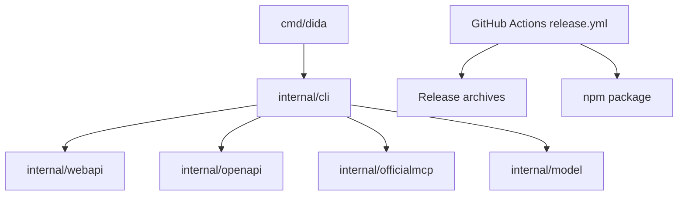

# Project Overview

## Preliminary Direction

Optimize DidaCLI's CI/CD, release, npm publishing, tag, and changelog governance using a clean, testable open-source maintainer workflow.

## Current Architecture

DidaCLI is a single Go CLI with a small npm wrapper package and GitHub Actions based distribution.

## Technology Stack

| Layer | Current | Target |
|:--|:--|:--|
| Language | Go 1.26.4 | Same |
| CLI | Standard library | Same |
| Build Tool | `go build`, Makefile | Same, with release-check target |
| Package Manager | npm wrapper in `npm/` | Same, with tested publish gates |
| Deployment | GitHub Releases + npm | Same, scripted and testable |

## Entry Points

- CLI binary: `cmd/dida/main.go`
- Release workflow: `.github/workflows/release.yml`
- CI workflow: `.github/workflows/ci.yml`
- npm package: `npm/package.json`, `npm/scripts/install.js`
- Release scripts: `scripts/validate-release-metadata.sh`, `scripts/generate-release-notes.sh`

## Build & Run

- `go test ./...`
- `go vet ./...`
- `go run golang.org/x/vuln/cmd/govulncheck@v1.3.0 ./...`
- `make release-check VERSION=vX.Y.Z`

## Testing Baseline

The project has Go package tests, shell script tests, npm installer tests, workflow linting via actionlint, archive validation, and packaging metadata validation. Current risk was CI-only behavior not covered locally: invalid task filters depended on auth state, and Windows coverage path handling treated `.out` as a package.

## Project Governance Baseline

- Shared instructions: `AGENTS.md`
- Claude-specific instructions: `CLAUDE.md`
- Release maintainer guide: `RELEASE.md`
- Active spec tracker: `docs/progress/MASTER.md`
- Native memory: Codex memory was used for repo discovery and prior npm release blocker context.

## External Integrations

- GitHub Releases
- GitHub Actions
- npm registry
- Dependabot
