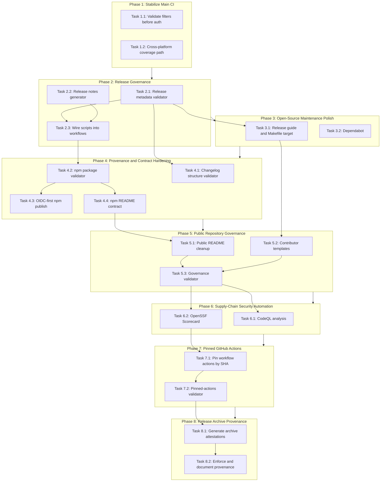

# Task Dependency Graph

```mermaid
graph TD
  subgraph Phase1["Phase 1: Stabilize Main CI"]
    T11["Task 1.1: Validate filters before auth"]
    T12["Task 1.2: Cross-platform coverage path"]
  end

  subgraph Phase2["Phase 2: Release Governance"]
    T21["Task 2.1: Release metadata validator"]
    T22["Task 2.2: Release notes generator"]
    T23["Task 2.3: Wire scripts into workflows"]
  end

  subgraph Phase3["Phase 3: Open-Source Maintenance Polish"]
    T31["Task 3.1: Release guide and Makefile target"]
    T32["Task 3.2: Dependabot"]
  end

  subgraph Phase4["Phase 4: Provenance and Contract Hardening"]
    T41["Task 4.1: Changelog structure validator"]
    T42["Task 4.2: npm package validator"]
    T43["Task 4.3: OIDC-first npm publish"]
    T44["Task 4.4: npm README contract"]
  end

  subgraph Phase5["Phase 5: Public Repository Governance"]
    T51["Task 5.1: Public README cleanup"]
    T52["Task 5.2: Contributor templates"]
    T53["Task 5.3: Governance validator"]
  end

  subgraph Phase6["Phase 6: Supply-Chain Security Automation"]
    T61["Task 6.1: CodeQL analysis"]
    T62["Task 6.2: OpenSSF Scorecard"]
  end

  subgraph Phase7["Phase 7: Pinned GitHub Actions"]
    T71["Task 7.1: Pin workflow actions by SHA"]
    T72["Task 7.2: Pinned-actions validator"]
  end

  subgraph Phase8["Phase 8: Release Archive Provenance"]
    T81["Task 8.1: Generate archive attestations"]
    T82["Task 8.2: Enforce and document provenance"]
  end

  T21 --> T23
  T22 --> T23
  T21 --> T31
  T21 --> T41
  T23 --> T42
  T42 --> T43
  T42 --> T44
  T44 --> T51
  T31 --> T52
  T51 --> T53
  T52 --> T53
  T53 --> T61
  T53 --> T62
  T62 --> T71
  T71 --> T72
  T72 --> T81
  T81 --> T82
  Phase1 --> Phase2
  Phase2 --> Phase3
  Phase3 --> Phase4
  Phase4 --> Phase5
  Phase5 --> Phase6
  Phase6 --> Phase7
  Phase7 --> Phase8
```
