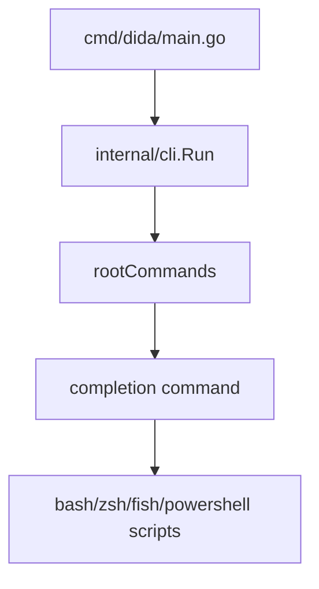

# Project Overview

## Direction

Add local shell completion generation for DidaCLI as the next v0.3.0 product-quality slice.

## Current Architecture

DidaCLI is a single Go binary. Root command dispatch lives in `internal/cli/root.go`, help text lives in `internal/cli/help.go`, and machine-readable command contracts live in `internal/cli/schema_cmd.go`.

## Technology Stack

| Layer | Current | Target |
|:--|:--|:--|
| Language | Go 1.26 | unchanged |
| CLI parser | standard library | unchanged |
| Dependencies | zero third-party Go modules | unchanged |
| Tests | Go unit tests | add completion tests |

## Entry Points

- `dida completion bash`
- `dida completion zsh`
- `dida completion fish`
- `dida completion powershell`

## Build and Test

- `go test ./internal/cli -run 'TestCompletion|TestCommandReferenceMentionsSchemaCommands'`
- `go test -count=1 ./...`
- `make release-check VERSION=v0.2.5`

## Governance Baseline

Shared rules are in `AGENTS.md`; Claude-specific rules are in `CLAUDE.md`. Native Codex memory is the durable memory surface. No repo-local fallback memory file is used.
