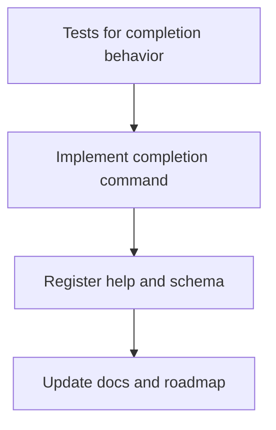

# Task Dependency Graph

```mermaid
graph TD
    T1["Tests for completion behavior"] --> T2["Implement completion command"]
    T2 --> T3["Register help and schema"]
    T3 --> T4["Update docs and roadmap"]
```
