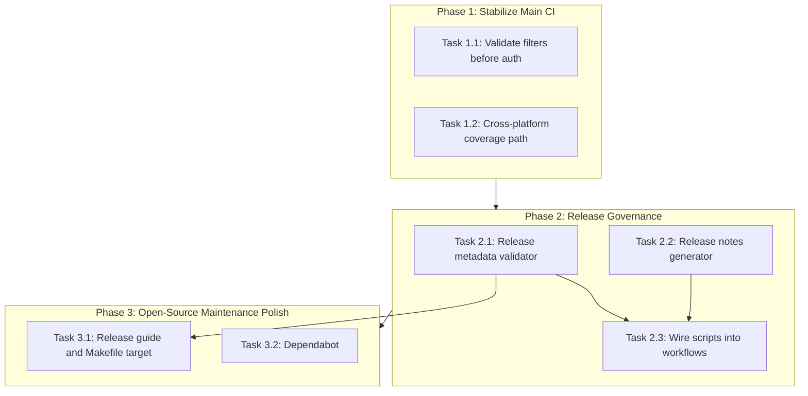

# Task Dependency Graph

```mermaid
graph TD
  subgraph Phase1["Phase 1: Stabilize Main CI"]
    T11["Task 1.1: Validate filters before auth"]
    T12["Task 1.2: Cross-platform coverage path"]
  end

  subgraph Phase2["Phase 2: Release Governance"]
    T21["Task 2.1: Release metadata validator"]
    T22["Task 2.2: Release notes generator"]
    T23["Task 2.3: Wire scripts into workflows"]
  end

  subgraph Phase3["Phase 3: Open-Source Maintenance Polish"]
    T31["Task 3.1: Release guide and Makefile target"]
    T32["Task 3.2: Dependabot"]
  end

  T21 --> T23
  T22 --> T23
  T21 --> T31
  Phase1 --> Phase2
  Phase2 --> Phase3
```
